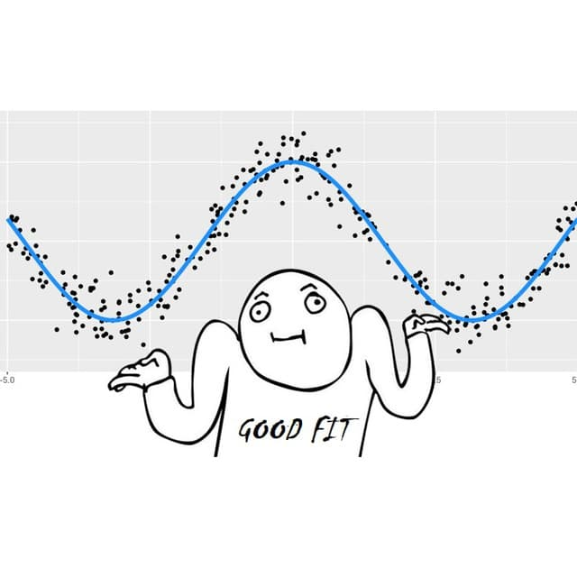
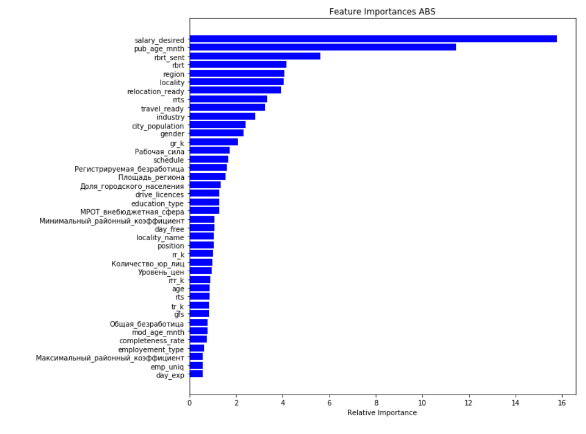

# PandemicDataHack#3 - комада GoodFit
## «Работа в России»: предсказание зарплаты
 

 

## Описание задачи
Создать статистическую модель, которая по профилю соискателя на портале «Работа в России» предсказывает заработную плату в зависимости от указанных соискателем характеристик и навыков.

## Структура каталога
```
.
├── data
│   ├── raw  [исходные файлы - исключены из репозитория]
│   ├── preprocessed  [предобработанные файлы - исключены из репозитория]
│   └── external - [внешние данные]
├── docs [**Документация проекта**] + Презентация
├── img [графики и картинки]
├── notebooks [jupyter notebooks]
├── submissions [файлы сабмитов]
├── utils [утилиты для предобработки данных]
├── visuals [отчеты]
└── README.md - этот файл

```
## Предообработка данных
* Датасет содержит много пропусков - заполняем пропуски специальными значениями именно как пропуски
* Даты публикации и изменения - переводим в возраст CV  от начал работы портала в месяцах
* Расчитываем опыт работы на последнем месте. Удаляем некорректные даты и нерелевантно большой опыт
* В датасете более половины признаков будут категориальными - иммеет смысл закродировать их средним
* Региональные и проф фичи - хорошо кодируються макроэкономическими показателями
* Сжатие ОКАТО в признак населенного пункта
* Счетчики по опыту работ и образованию
## Использованные внешние данные
* Макроэкономика по регионам
* Макроэкономика по городам
## Использованные модели
* CatBoost - т.к. категориальных признаков много, а этот алгоритм градиентного бустинга хорошо справляеться с категориальными фичами кодируя их средним и не допуская ликов
* Две предобученных Bert модели от DeepPavlov (rubert-base-cased и rubert-base-cased-sentence) - мы объединили позицию, описание работы и достижений в один текст (избавились от HTML тегов) и сделали  Fine tuning двух моделелй (на colab) - модели зная только текстовые описания уверенно давали на валидации 1.05 и 1.07 по целевой метрике - мы добавили предсказание этих моделей в Train b Test  и получили прирост метрики в 2 пункта в 3 знаке - на сильно оптимизированной модели
* Гипероптимизация параметров с помощью Hyperopt
* Использовали AutoML pycaret на первых этапх для проверки гипотез
## Важность признаков
 

## Инсайты
* С учетом того что метрику RMSLE сложно использовать для прямой оптимизации (не определена для всех отрицательных значений) - полезно сразу логарифмировать целевую метку и оптимизировать RMSE
* Важно было сразу понять как устроена разбивка на train test. Мы ожидаем на своем привате 0.99 -1.0 (чуть хуже чем на паблике)
* Мы проверили модель, убрав из теста примеры с 0 значением з.п. - это дает приблизительно 1.004 на паблик Leader Board
